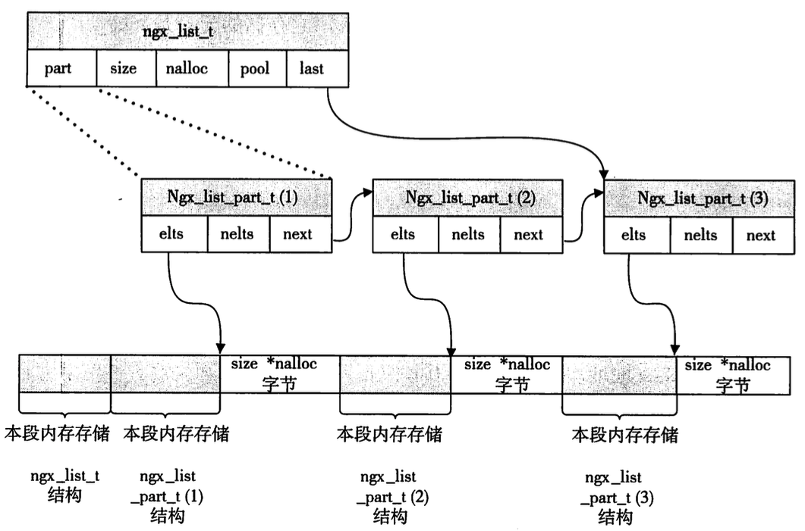

# Nginx 链表设计
## 普通的链表模式：

 
图片引用自[NormalLinkList]

正常来讲，data和next域封装在一个class或者struct当中。

## Nginx 链表结构  

为了避免data占用过小的内存，而使得整体链表有效数据内存占用率较低，转而将data部分申请为动态内存，并作为数组使用使得一个data数组能够存储多个data元素的方式，来提升真实数据的内存占用率，而避免链表的next域等占用大部分内存，同时在遍历的时候，能够带来至少两点益处：    

- 减少next的循环
- data内部可以通过直接内存访问的方式取的元素

图片引用自[NginxLinkList]

[NormalLinkList]: https://lixiyan4633.gitee.io/2020/03/19/%E6%95%B0%E6%8D%AE%E7%BB%93%E6%9E%84%E7%AE%97%E6%B3%95Day04-%E9%93%BE%E8%A1%A8/ "链表结构"
[NginxLinkList]: ../book/深入理解Nginx.pdf "nginx book"