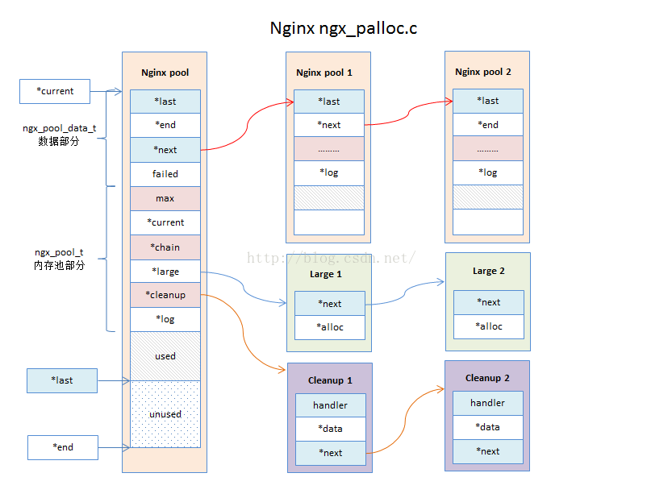

# 内存池

Nginx的内存管理是通过内存池来实现的。Nginx的内存池的设计非常的精巧，很多场景下，我们可以将Nginx的内存池实现抽象出来改造成我们开发中的内存池。

## 常见的内存分配

一般我们使用malloc/alloc/free等函数来分配和释放内存。但是直接使用这些函数会有一些弊端：

虽然系统自带的ptmalloc内存分配管理器，也有自己的内存优化管理方案（申请内存块以及将内存交还给系统都有自己的优化方案，具体可以研究一下ptmalloc的源码），但是直接使用malloc/alloc/free，仍然会导致内存分配的性能比较低。
频繁使用这些函数分配和释放内存，会导致内存碎片，不容易让系统直接回收内存。**典型的例子就是大并发频繁分配和回收内存，会导致进程的内存产生碎片，并且不会立马被系统回收**，**容易产生内存泄露。**

## 使用内存池分配内存有几点好处：

提升内存**分配效率**。不需要每次分配内存都执行malloc/alloc等函数。
让**内存的管理变得更加简单**。内存的分配都会在一块大的内存上，回收的时候只需要回收大块内存就能将所有的内存回收，防止了内存管理混乱和内存泄露问题。

# 数据结构定义

## 内存池主结构定义

### ngx_pool_s  ngx_pool_t 内存池主结构

```c++
struct ngx_pool_s {
    ngx_pool_data_t       d;       /* 内存池的数据区域*/
    size_t                max;     /* 最大每次可分配内存 */
    ngx_pool_t           *current; /* 指向当前的内存池指针地址。ngx_pool_t链表上最后一个缓存池结构*/
    ngx_chain_t          *chain;   /* 缓冲区链表 */
    ngx_pool_large_t     *large;   /* 存储大数据的链表 */
    ngx_pool_cleanup_t   *cleanup; /* 可自定义回调函数，清除内存块分配的内存 */
    ngx_log_t            *log;     /* 日志 */
};
```

### ngx_pool_data_t 数据区域结构

```c++
typedef struct {
    u_char               *last;    /* 内存池中未使用内存的开始节点地址 */
    u_char               *end;     /* 内存池的结束地址 */
    ngx_pool_t           *next;    /* 指向下一个内存池 */
    ngx_uint_t            failed;  /* 失败次数*/
} ngx_pool_data_t;
```


### ngx_pool_large_s  ngx_pool_large_t 大数据块结构

```c++
struct ngx_pool_large_s {
    ngx_pool_large_t     *next;   /* 指向下一个存储地址 通过这个地址可以知道当前块长度 */
    void                 *alloc;  /* 数据块指针地址 */
};
```

### ngx_pool_cleanup_s  ngx_pool_cleanup_t 自定义清理回调的数据结构

```c++
struct ngx_pool_cleanup_s {
    ngx_pool_cleanup_pt   handler; /* 清理的回调函数 */
    void                 *data;    /* 指向存储的数据地址 */
    ngx_pool_cleanup_t   *next;    /* 下一个ngx_pool_cleanup_t */
};
```


# 内存结构图

