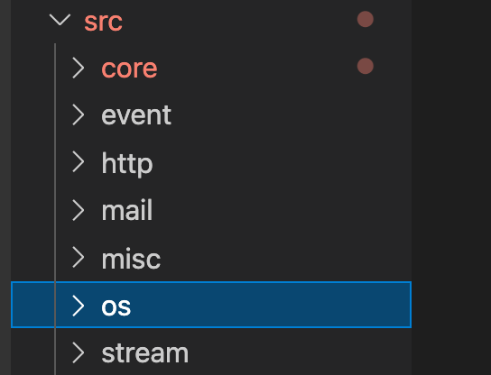
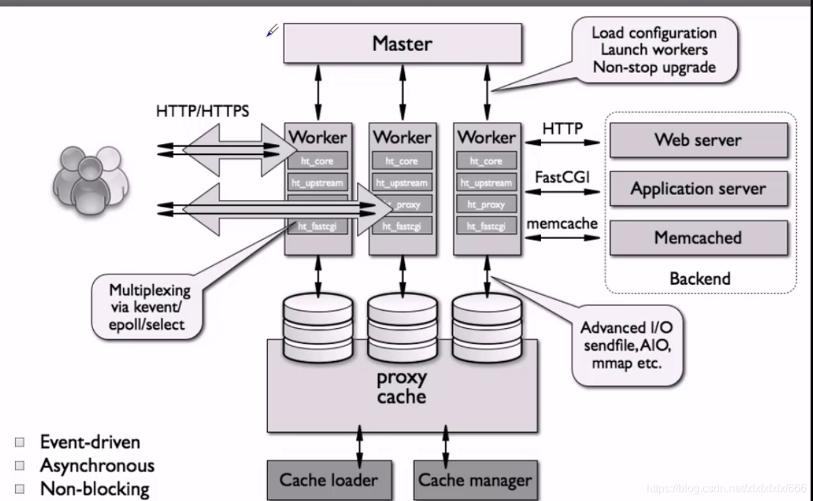
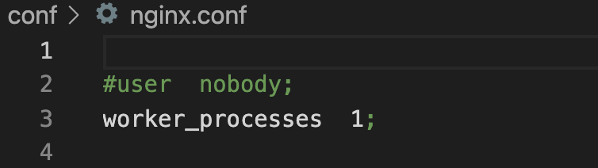
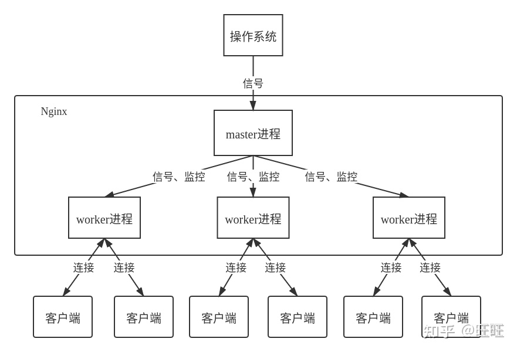
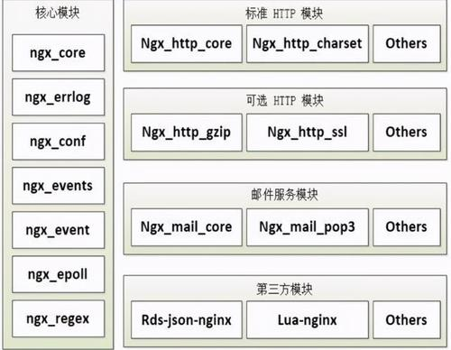

# 代码树

## 主要的几个模块

### core

core：包含了Nginx的最基础的库和框架。包括了**内存池、链表、hashmap、String等**常用的数据结构。

### event

event：事件模块。Nginx自己实现了**事件模型**。而我们所熟悉的Memcached是使用了Libevent的事件库。自己实现event会性能和效率方便更加高效。

### http模块

http：实现HTTP的模块。实现了**HTTP的具体协议的各种模块**，该部分内容量比较大。

# nginx 架构

## nginx 进程结构

Nginx是一款多进程的软件。Nginx启动后，会产生一个master进程和N个工作进程。其中nginx.conf中可以配置工作进程的个数。

### 进程模型图

多进程模块有一个非常大的好处，就是不需要**太多考虑并发锁**的问题。

我们常见的软件**Memcached**就和Nginx相反，就是典型的**多线程**模型的c语言软件。

- Nginx 启动后，会产生一个 master 主进程，主进程执行一系列的工作后会产生一个或者多个工作进程 worker
- 在客户端请求动态站点的过程中，Nginx 服务器还涉及和后端服务器的通信。Nginx 将接收到的 Web 请求通过代理转发到后端服务器，由后端服务器进行数据处理和组织；
- Nginx 为了提高对请求的响应效率，降低网络压力，采用了**缓存**机制，将历史应答数据缓存到本地。保障对缓存文件的快速访问

### master进程

**master进程主要用来管理worker进程，具体包括如下4个主要功能**：

- 接收来自外界的信号。
- 向各worker进程发送信号。
- 监控woker进程的运行状态。
- 当woker进程退出后（异常情况下），会自动重新启动新的woker进程。
- nginx支持通过配置只运行master而不启动worker,便于调试用

### worker进程

**woker进程主要用来处理基本的网络事件**：

- 多个worker进程之间是对等且相互独立的，他们同等竞争来自客户端的请求。
- 一个请求，只可能在一个worker进程中处理，一个worker进程，不可能处理其它进程的请求。
- worker进程的个数是可以设置的，一般我们会设置与机器cpu核数一致。更多的worker数，只会导致进程来竞争cpu资源了，从而带来不必要的上下文切换。而且，nginx为了更好的利用多核特性，具有cpu绑定选项，我们可以将某一个进程绑定在某一个核上，这样就不会因为进程的切换带来cache的失效。

### 守护线程 daemon

nginx在启动后，在unix系统中会以daemon的方式在后台运行，后台进程包含一个master进程和多个worker进程。当然nginx也是支持多线程的方式的，只是我们主流的方式还是多进程的方式，也是nginx的默认方式。

### 进程控制
- master会一直监控worker的运行情况，一旦某个worker状态异常，master负责重启所有worker
- 控制nginx通过向master发送信号，master通过接收到的信号对整个nginx进行控制

#### 手动发送信号

可以通过kill向master进程发送信号，比如**kill -HUP pid**用以通知Nginx从容重启。所谓从容重启就是**不中断服务**：master进程在接收到信号后，会先重新加载配置，然后再**启动新进程开始接收新请求**，并向所有**老进程**发送信号告知**不再接收新请求**并在**处理完所有未处理完的请求后自动退出**。

#### 自动发送信号

可以通过带命令行参数启动新进程来发送信号给master进程，比如**./nginx -s reload**用以启动一个新的Nginx进程，而新进程在解析到reload参数后会向master进程发送信号（新进程会帮我们把手动发送信号中的动作自动完成）。当然也可以这样./nginx -s stop来停止Nginx。

# nginx模块设计

高度模块化的设计是Nginx的架构基础。Nginx服务器被分解为多个模块，每个模块就是一个功能模块，只负责自身的功能，模块之间严格遵循“高内聚，低耦合”的原则。

